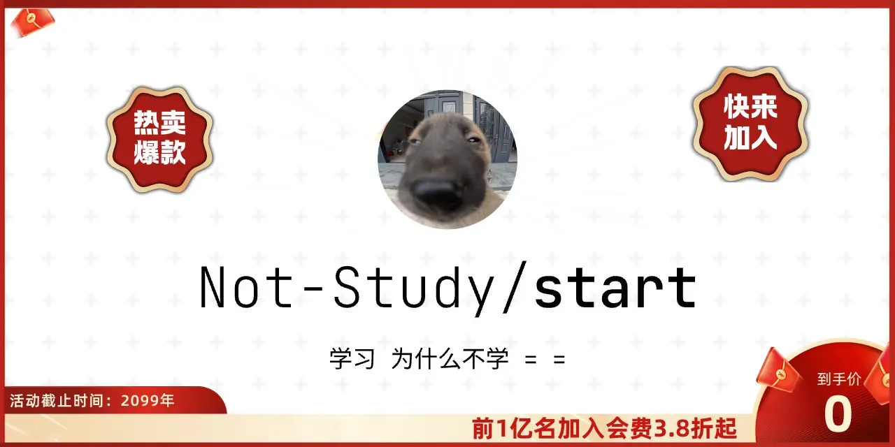

<picture>
  <source media="(prefers-color-scheme: dark)" srcset="./banner/banner-dark.webp">
  <source media="(prefers-color-scheme: light)" srcset="./banner/banner-light.webp">
  
</picture>

## Not Study

一个专注于学习打卡的组织。

## 快速开始

### 加入组织

1. 提交 [Issue](../../issues/new/choose) 选择「申请加入组织」
2. 等待管理员审核通过

### 创建学习仓库

1. 提交 [Issue](../../issues/new/choose) 选择「申请个人仓库」
2. 仓库命名：`not-study-你的用户名`
3. 等待自动创建完成

## 学习打卡

- 每天在你的仓库提交代码或笔记
- 系统每天 00:00 自动统计所有仓库的提交记录
- 查看统计数据：[records](./records)

## 权限说明

- ✅ 你的仓库：可读写
- 👀 其他仓库：只读

## 管理员

### 审批申请

在 Issue 上添加 `approved` 标签或评论 `/approve` 即可自动处理。

### 启用完全自动化

需要配置 Personal Access Token，详见 [.github/Configure.md](./.github/Configure.md)

---

**Not Study!** 🎓
